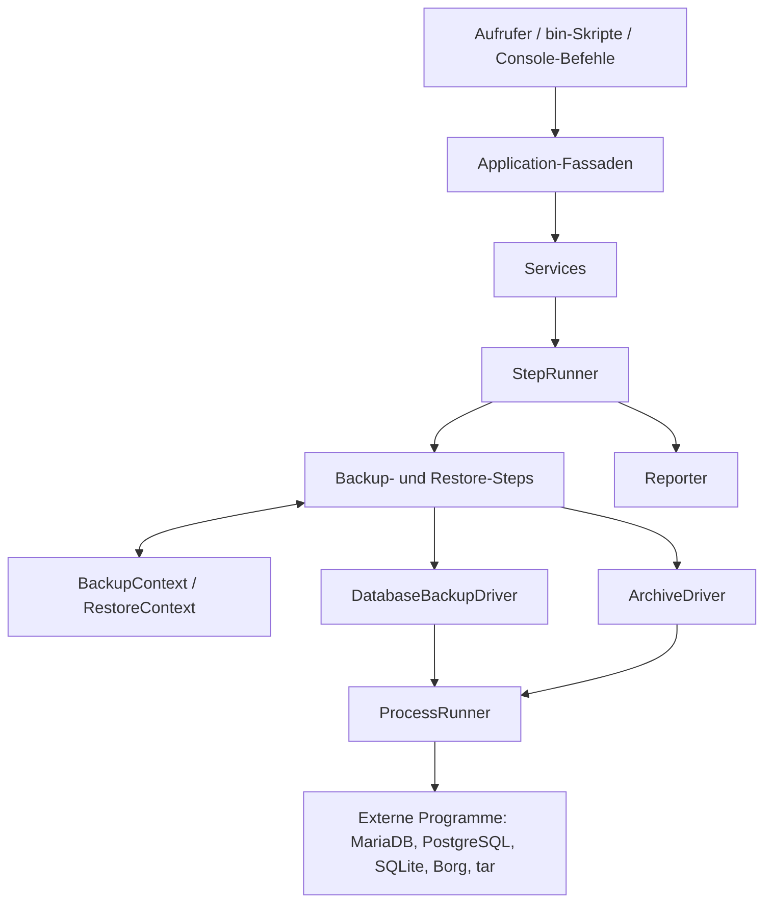

# Architektur

## Zweck und Umfang

Backup-Kit ist eine PHP-Bibliothek für Datenbank-Dumps und Dateiarchive. Sie bündelt die Abläufe in wiederverwendbaren Anwendungen und Services, während Datenbank-, Archiv- und Prozesszugriffe hinter austauschbaren Interfaces liegen.

Das Paket verwendet PHP 8.3 oder neuer und den PSR-4-Namespace `Deagel1337\Backup\Kit\` für den Ordner `src/`. Es ist als Composer-Bibliothek ausgelegt. Die enthaltenen Symfony-Console-Befehle und Skripte sind Beispiele beziehungsweise Bausteine, aber keine vollständig vorkonfigurierte Kommandozeilenanwendung.

## Schichten und Abhängigkeiten



| Bereich | Verantwortung |
| --- | --- |
| `Application/` | Einstiegspunkte, die Laufzeitkontext erzeugen und Services aufrufen. Dazu gehören die Datenbank-Backup- und -Restore-Anwendungen sowie `ArchiveApplication`. |
| `Services/` | Orchestrierung der Arbeitsschritte und Delegation an Treiber. `RestoreService` koordiniert zusätzlich einen Rollback-Versuch. |
| `Step/` | Kleine, kombinierbare Operationen für Backup und Restore, etwa Speicherplatz prüfen, Dump erzeugen, Archiv extrahieren oder Datenbank wiederherstellen. |
| `Context/` und die Model-Klassen in `Archive/` und `DatabaseBackup/` | Transport von Laufzeitdaten zwischen Schritten. Dazu zählen Dumps, Archivinformationen, Quellpfade, Ziele und optionale Rollback-Dumps. |
| `DatabaseBackup/` und `Archive/` | Treiberverträge, konkrete Backends und deren Datenmodelle. |
| `Process/` | Abstraktion für externe Prozesse und deren Ergebnis. |
| `Reporter/` | Ausgabe von Prozessmeldungen und Fortschritt eines Step-Ablaufs. |
| `Console/` | Symfony-Console-Befehle für Datenbank- und Borg-Aufgaben. |

Die wesentlichen Erweiterungsverträge sind `DatabaseBackupDriver`, `ArchiveDriver`, `ProcessRunner`, `BackupStep`, `RestoreStep` und `ProgressReporter`.

## Datenbank-Backup

Der vorgesehene Ablauf für einen Datenbank-Dump ist:

1. Eine Anwendung erstellt einen `BackupContext` mit Zielpfad und Quelldateien.
2. `ValidateBackupContextStep` prüft Datenbankanforderungen, Quelldateien und das Zielverzeichnis.
3. `BackupDatabaseStep` erzeugt und validiert den Dump.
4. `ArchiveBackupStep` archiviert Dump und Quelldateien; `VerifyBackupArchiveStep` prüft, ob alle erwarteten Einträge im Archiv vorhanden sind.
5. Temporäre Dumps werden bei angeforderter Bereinigung auch nach einem fehlgeschlagenen Ablauf entfernt. Retention läuft erst nach erfolgreicher Archivprüfung.

Der Step-Aufbau erlaubt zusätzliche Operationen wie Speicherplatzprüfung oder Kontextausgabe. Die Schritte werden vom Aufrufer zusammengestellt; es gibt keinen universellen, automatisch konfigurierten Backup-Ablauf.

### Datenbanktreiber

- `MariaDbBackupDriver` verwendet `mariadb-dump` und `mariadb`.
- `PostgresBackupDriver` verwendet `pg_dump` und `psql`.
- `SqliteBackupDriver` verwendet `sqlite3` für das Backup und kopiert die Datenbankdatei für das Restore.

Die Treiber implementieren `DatabaseBackupDriver`. Sie validieren die Kompatibilität des Dumps anhand von Treiberkennung, Format und Datei-Eigenschaften. Die externen Client-Programme müssen auf dem ausführenden System installiert sein.

## Datenbank-Restore und Rollback

`RestoreMariaDbApplication` erstellt einen `RestoreContext` und übergibt die konfigurierten Restore-Steps an `RestoreService`. `RestoreDatabaseStep` verlangt einen Dump und delegiert die Wiederherstellung an `restoreDump()` des Datenbanktreibers.

`ValidateRestoreContextStep` prüft verfügbare Treiber, Archiv und Dump sowie Zielpfade. Archiv-Einträge mit Pfad-Traversal oder leere Archive werden abgewiesen. `RestoreArchiveStep` kann in ein optionales `stagingDestination` extrahieren; die Anwendung, die den Restore konfiguriert, ist für die anschließende Veröffentlichung des Staging-Inhalts zuständig.

Optional kann vor dem Restore mit `CreateDatabaseBackupStep` ein validierter Sicherungsdump erstellt und im Kontext abgelegt werden. `RestoreService` versucht das Rollback nur, wenn `RestoreDatabaseStep` tatsächlich begonnen hat. Der Snapshot wird danach aus dem lokalen Dateisystem entfernt. Die Standardfabrik von `RestoreMariaDbApplication` verwendet `MariaDbRestoreRollbackHandler`. Das Rollback ist kein Ersatz für ein unabhängig getestetes Disaster-Recovery-Verfahren. `RestoreDatabaseStep` unterstützt außerdem einen optionalen Health-Check-Callback nach erfolgreicher Wiederherstellung; ein Fehler darin löst ebenfalls das Rollback aus.

## Archivierung

`ArchiveApplication` bildet die Anwendungsfassade für Erstellen, Auflisten, Extrahieren und Aufräumen (`prune(RetentionPolicy)`). Sie delegiert an `ArchiveService`, der den `ArchiveDriver` verwendet und bei den entsprechenden Operationen Archivvalidierungen ausführt.

Implementierte Treiber:

- `BorgArchiveDriver` erstellt und listet Borg-Archive und extrahiert sie wieder. Repository, Passphrase sowie optionale SSH-Parameter werden dem Treiber übergeben.
- `TarArchiveDriver` erstellt gzip-komprimierte TAR-Archive, listet deren Inhalte und kann sie extrahieren.

`BackupApplicationFilesStep` verbindet Dateiarchivierung mit einem Backup-Ablauf, indem der Step den Archivtreiber verwendet und das Ergebnis im `BackupContext` ablegt. Restore-Steps verbinden entsprechend Archivprüfung und -extraktion mit dem `RestoreContext`.


### Framework-neutraler Backup-Workflow

`BackupApplication` kombiniert Datenbankdump, Archivierung (`ArchiveBackupStep`), optionales Löschen des Dumps und optionales Aufräumen alter Archive (`PruneArchivesStep`) zu einem Aufruf. Sie gibt nichts aus, sondern liefert ein `BackupResult` (Archiv, Dump, Dauer, Status). Der `ProgressReporter` ist injizierbar; Standard ist `NullProgressReporter`. Damit eignet sich die Klasse für Symfony-Commands, Laravel-Jobs/Scheduler, Cron-Skripte und Queue-Worker. Aufbewahrungsregeln werden über `RetentionPolicy` definiert, auch aus Konfigurationsarrays (`RetentionPolicy::fromArray(['daily' => 7, 'monthly' => 6])`).

```php
$result = (new BackupApplication($databaseDriver, $archiveService, $reporter))->run(
    dumpPath: '/tmp/db.sql',
    archiveName: 'backup-'.date('Y-m-d'),
    files: ['/var/www/storage/app'],
    retention: RetentionPolicy::fromArray(['daily' => 7, 'weekly' => 4]),
);
```

## Externe Prozesse

Datenbank- und Archivtreiber rufen Systemprogramme über `ProcessRunner` auf. `ProcOpenProcessRunner` führt die Programme aus; `DryRunProcessRunner` ermöglicht, Prozessaufrufe ohne tatsächliche Ausführung zu testen. Prozessaufrufe werden als Argumentlisten statt als zusammengesetzte Shell-Befehle übergeben. Der Runner unterstützt unter anderem Umgebungsvariablen, Arbeitsverzeichnis sowie Datei-Ein- und -Ausgabe und liefert Exit-Code, stdout und stderr als `ProcessResult`.

Datenbanktreiber geben Passwörter für ihre Clientprogramme über Prozess-Umgebungsvariablen weiter (zum Beispiel `MYSQL_PWD` oder `PGPASSWORD`), nicht als Kommandozeilenargumente. Zugangsdaten und Repository-Konfiguration sollten von der aufrufenden Anwendung verwaltet und nicht in Beispielskripten oder im Versionskontrollsystem hinterlegt werden.

## Fehlerbehandlung und Fortschritt

- Ungültige oder unbrauchbare Dumps führen zu spezialisierten Exceptions aus `Exception/DumpDriverException/`.
- Ein fehlgeschlagener Prozess wird anhand seines Exit-Codes erkannt; die Treiber melden den Fehler mit der Prozessausgabe.
- `StepRunner` informiert den Reporter über den Fortschritt und gibt eine aufgetretene Exception weiter.
- `RestoreService` versucht bei einem Fehler das konfigurierte Rollback und gibt danach den Restore-Fehler erneut weiter, sofern das Rollback selbst erfolgreich ist.
- Reporter können über die entsprechenden Interfaces ersetzt werden. Prozess- und Step-Fortschritt werden getrennt behandelt.

## Konsolen- und Skripteinstiegspunkte

`src/Console/` enthält Befehle für Borg-Archive und Datenbank-Dumps. `bin/` enthält Beispielskripte. Eine integrierende Anwendung muss die gewünschten Treiber, Verbindungen, Archiveinstellungen und Befehle selbst instanziieren beziehungsweise registrieren. Vorhandene Skripte sind deshalb nicht ohne Prüfung als produktionsfertige Konfiguration zu verstehen.

## Tests

Die PHPUnit-Tests sind in zwei Bereiche gegliedert:

- `tests/Unit/` prüft Treiber, Services, Steps, Applications, Reporter, Prozessrunner und Hilfstraits überwiegend isoliert.
- `tests/Integration/` prüft Zusammenspiel von Komponenten, Prozessausführung und ausgewählte Datenbank- beziehungsweise Archivabläufe.

`DryRunProcessRunner` und Test-Doubles entkoppeln viele Tests von installierten externen Programmen. Ein erfolgreicher Unit- oder Dry-Run-Test beweist daher nicht, dass die Zielmaschine, ihre Datenbankverbindung oder ihr Borg-Repository korrekt eingerichtet ist. Für die MariaDB-Integrationstests stellt `docker-compose.yml` einen Testdienst bereit.

## Implementierungsstand und bekannte Grenzen

Die folgenden Punkte beschreiben den aktuellen Code und sind wichtig, wenn neue Abläufe darauf aufbauen:

- `RestoreMariaDbApplication` ist auf MariaDB ausgerichtet und verwendet einen MariaDB-spezifischen Rollback-Handler, obwohl die Factory einen allgemeinen `DatabaseBackupDriver` entgegennimmt. Für andere Datenbanktreiber sollte der Restore-/Rollback-Pfad nicht ohne Anpassung als unterstützt angenommen werden.
- Es gibt noch keine allgemeine Restore-Application; `RestoreMariaDbApplication` bleibt MariaDB-spezifisch.
- Das optionale Restore-Staging isoliert die Extraktion, veröffentlicht den fertigen Inhalt aber nicht automatisch am produktiven Ziel.
- Einige Backup- und Restore-Steps greifen direkt auf Treiber zu, statt jede Operation über den entsprechenden Service zu führen. Validierungen eines Services gelten deshalb nicht automatisch für jeden Step-Aufruf.

Diese Einschränkungen sind keine Zusicherung über künftige Versionen. Für produktive Restore-Szenarien sollten die konkreten Abläufe einschließlich Fehlerfall und Wiederherstellung in der Zielumgebung getestet werden.
